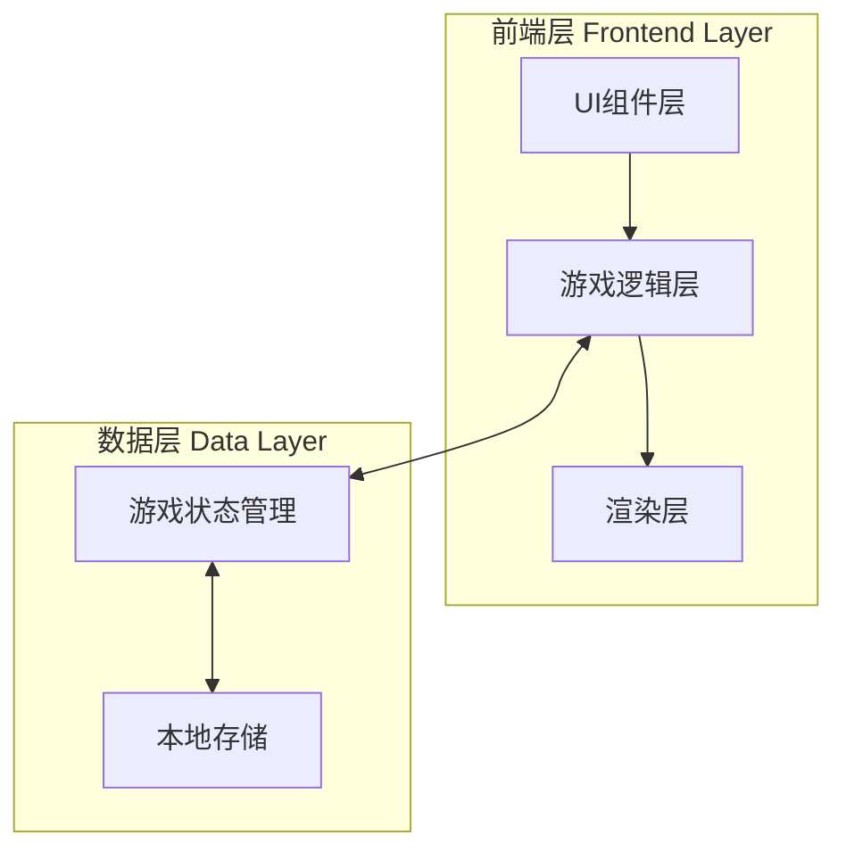

# 贪吃蛇游戏技术架构文档

## 1. 架构设计



## 2. 技术说明

- **前端框架**：React@18 + TypeScript
- **样式方案**：Tailwind CSS@3 + CSS Modules（用于复杂动画）
- **构建工具**：Vite
- **动画库**：Framer Motion（用于UI动画过渡）
- **游戏渲染**：Canvas API + requestAnimationFrame
- **状态管理**：React useState + useReducer（轻量级状态管理）
- **数据持久化**：localStorage

## 3. 路由定义

| 路由 | 用途 |
|-----|------|
| `/` | 游戏主页面，包含开始界面和游戏界面 |

## 4. 项目结构

```
src/
├── components/
│   ├── Game/
│   │   ├── GameCanvas.tsx      # 游戏画布组件
│   │   ├── GameControls.tsx    # 游戏控制按钮
│   │   ├── ScorePanel.tsx      # 分数面板
│   │   └── GameOverModal.tsx   # 游戏结束弹窗
│   ├── Menu/
│   │   ├── StartScreen.tsx     # 开始界面
│   │   └── GameTitle.tsx       # 游戏标题
│   └── ui/
│       ├── Button.tsx          # 通用按钮组件
│       └── Modal.tsx           # 通用弹窗组件
├── hooks/
│   ├── useGameLoop.ts          # 游戏循环Hook
│   ├── useSnake.ts             # 蛇逻辑Hook
│   ├── useFood.ts              # 食物逻辑Hook
│   ├── useCollision.ts         # 碰撞检测Hook
│   └── useKeyboard.ts          # 键盘控制Hook
├── lib/
│   ├── gameEngine.ts           # 游戏引擎核心逻辑
│   ├── renderer.ts             # Canvas渲染器
│   └── utils.ts                # 工具函数
├── types/
│   └── game.ts                 # 游戏类型定义
├── constants/
│   └── gameConfig.ts           # 游戏配置常量
└── pages/
    └── Game.tsx                # 游戏主页面
```

## 5. 核心类型定义

```typescript
// types/game.ts

interface Position {
  x: number;
  y: number;
}

interface Snake {
  body: Position[];
  direction: Direction;
  speed: number;
}

type Direction = 'UP' | 'DOWN' | 'LEFT' | 'RIGHT';

interface Food {
  position: Position;
  type: 'normal' | 'bonus';
}

interface GameState {
  snake: Snake;
  food: Food;
  score: number;
  highScore: number;
  status: 'idle' | 'playing' | 'paused' | 'gameover';
}

interface GameConfig {
  canvasSize: number;
  gridSize: number;
  initialSpeed: number;
  speedIncrement: number;
}
```

## 6. 游戏引擎设计

### 6.1 游戏循环

```mermaid
flowchart LR
    A[输入处理] --> B[更新游戏状态]
    B --> C[碰撞检测]
    C --> D{是否碰撞?}
    D --> "|是| E[游戏结束]"
    D --> "|否| F[渲染画面]"
    F --> G[等待下一帧]
    G --> A
```

### 6.2 核心函数

| 函数名 | 功能描述 |
|-------|---------|
| `initGame()` | 初始化游戏状态 |
| `updateSnake()` | 更新蛇的位置 |
| `generateFood()` | 生成食物位置 |
| `checkCollision()` | 检测碰撞（墙壁、自身） |
| `handleInput()` | 处理键盘/触摸输入 |
| `render()` | 渲染游戏画面 |
| `gameLoop()` | 游戏主循环 |

## 7. 渲染方案

### 7.1 Canvas渲染策略

- 使用双层Canvas：背景层 + 游戏层
- 背景层：静态网格，仅在初始化时绘制一次
- 游戏层：每帧重绘蛇和食物

### 7.2 动画实现

| 动画效果 | 实现方式 |
|---------|---------|
| 蛇移动 | Canvas逐帧绘制 + 插值动画 |
| 食物脉动 | CSS动画 + Canvas绘制 |
| 发光效果 | Canvas shadowBlur属性 |
| UI过渡 | Framer Motion动画组件 |

## 8. 数据模型

### 8.1 本地存储结构

```typescript
interface LocalStorageData {
  highScore: number;        // 最高分
  lastPlayed: string;       // 最后游戏时间
  settings: {
    soundEnabled: boolean;  // 音效开关
    theme: 'neon' | 'classic'; // 主题
  };
}
```

### 8.2 存储键名

| 键名 | 存储内容 |
|-----|---------|
| `snake_game_high_score` | 最高分记录 |
| `snake_game_settings` | 游戏设置 |

## 9. 性能优化策略

- **减少重绘**：仅重绘变化区域
- **对象池**：复用粒子效果对象
- **节流输入**：防止快速连续按键
- **离屏Canvas**：预渲染静态元素
- **requestAnimationFrame**：确保流畅动画

## 10. 触摸控制设计

| 手势 | 操作 |
|-----|------|
| 向上滑动 | 蛇向上移动 |
| 向下滑动 | 蛇向下移动 |
| 向左滑动 | 蛇向左移动 |
| 向右滑动 | 蛇向右移动 |
| 双击 | 暂停/继续游戏 |
